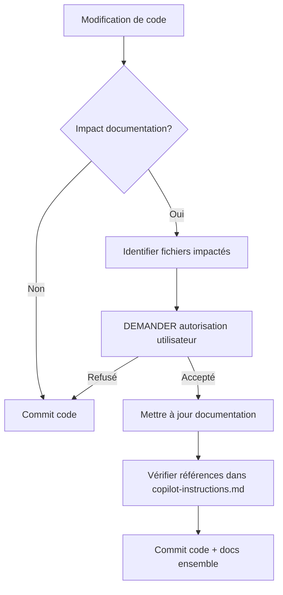

# Documentation Guidelines - Mad Mathematics

**Dernière mise à jour:** 11 novembre 2025  
**Objectif:** Maintenir une documentation toujours synchronisée avec le code

---

## 🎯 Principes Fondamentaux

### 1. **Documentation as Code**
La documentation fait partie intégrante du projet. Elle doit être :
- ✅ **À jour** - Synchronisée avec chaque modification de code
- ✅ **Versionnée** - Commitée avec les changements de code
- ✅ **Accessible** - Centralisée et facile à trouver
- ✅ **Utile** - Contient des informations actionnables, pas des évidences

### 2. **La règle d'or : Demander avant de documenter**
> **Toute mise à jour de documentation nécessite l'autorisation explicite de l'utilisateur**

Processus obligatoire :
1. 🔍 Détecter qu'une modification de code nécessite une mise à jour de documentation
2. 🤚 **STOP** - Ne pas modifier la documentation immédiatement
3. 💬 Demander à l'utilisateur : "Cette modification impacte [fichier.md]. Dois-je mettre à jour la documentation ?"
4. ✅ Attendre confirmation avant toute modification
5. 📝 Mettre à jour uniquement après approbation

**Pourquoi ?** L'utilisateur peut avoir des raisons de ne pas documenter immédiatement (travail en cours, branche expérimentale, etc.).

---

## 📁 Organisation des Fichiers

### Structure Obligatoire

```
mad-mathematics/
├── .github/
│   └── copilot-instructions.md      # Index principal (TOUJOURS à jour)
├── docs/                             # Dossier centralisé pour toutes les instructions
│   ├── README.md                     # Index du dossier docs
│   ├── TESTING_GUIDELINES.md         # Guidelines de tests unitaires
│   ├── INTEGRATION_TESTING.md        # Guidelines de tests d'intégration (futur)
│   ├── E2E_TESTING.md                # Guidelines de tests E2E (futur)
│   ├── ACCESSIBILITY.md              # Guidelines d'accessibilité (futur)
│   ├── DEPLOYMENT.md                 # Procédures de déploiement
│   └── ARCHITECTURE.md               # Décisions d'architecture (ADR)
├── CODE_REVIEW.md                    # Revue de code (racine OK car one-off)
└── README.md                         # Vue d'ensemble du projet
```

### Règles de Placement

| Type de document | Emplacement | Exemple |
|------------------|-------------|---------|
| **Instructions pour AI agents** | `.github/copilot-instructions.md` | Index principal |
| **Guidelines techniques** | `docs/*.md` | Tests, déploiement, architecture |
| **Revues/Audits** | Racine (`*.md`) | CODE_REVIEW.md |
| **README projet** | Racine | README.md |
| **Documentation code** | À côté du code | JSDoc inline |

---

## 📝 Types de Documentation

### 1. **`.github/copilot-instructions.md`** (Index principal)

**Rôle:** Point d'entrée unique pour tous les AI agents et développeurs.

**Contenu obligatoire:**
- Vision et architecture du projet (big picture)
- Conventions de code spécifiques au projet
- Références vers TOUTE la documentation technique
- Workflows critiques (build, test, deploy)

**Format de référence:**
```markdown
## 📚 Documentation Technique

Pour des guidelines détaillées, consultez :

- **Tests unitaires:** [`docs/TESTING_GUIDELINES.md`](../docs/TESTING_GUIDELINES.md)
- **Tests d'intégration:** [`docs/INTEGRATION_TESTING.md`](../docs/INTEGRATION_TESTING.md)
- **Déploiement:** [`docs/DEPLOYMENT.md`](../docs/DEPLOYMENT.md)
- **Architecture:** [`docs/ARCHITECTURE.md`](../docs/ARCHITECTURE.md)
```

**Mise à jour requise quand:**
- ✅ Nouveau fichier de documentation créé dans `docs/`
- ✅ Changement architectural majeur
- ✅ Nouvelle convention de code adoptée
- ✅ Modification de workflow critique

### 2. **`docs/*.md`** (Guidelines techniques)

**Rôle:** Documentation détaillée et spécialisée par domaine.

**Exemples:**
- `TESTING_GUIDELINES.md` - Comment écrire des tests
- `DEPLOYMENT.md` - Procédure de déploiement
- `ARCHITECTURE.md` - Décisions d'architecture
- `ACCESSIBILITY.md` - Standards d'accessibilité

**Format standard:**
```markdown
# [Sujet] - Mad Mathematics

**Dernière mise à jour:** [Date]
**Scope:** [Périmètre du document]

## Table des matières
- [Section 1](#section-1)
- [Section 2](#section-2)

## Section 1
[Contenu...]

---

**Dernière révision:** [Raison de la mise à jour]
```

**Mise à jour requise quand:**
- ✅ Code modifié dans le domaine concerné
- ✅ Nouvelle best practice adoptée
- ✅ Correction d'erreur dans la documentation
- ✅ Ajout de nouveaux exemples

### 3. **`docs/README.md`** (Index du dossier)

**Rôle:** Table des matières du dossier `docs/`.

**Contenu:**
```markdown
# Documentation Technique - Mad Mathematics

Index de toute la documentation technique du projet.

## 🧪 Tests
- [TESTING_GUIDELINES.md](./TESTING_GUIDELINES.md) - Tests unitaires (shared.js)
- [INTEGRATION_TESTING.md](./INTEGRATION_TESTING.md) - Tests d'intégration
- [E2E_TESTING.md](./E2E_TESTING.md) - Tests end-to-end

## 🚀 Déploiement
- [DEPLOYMENT.md](./DEPLOYMENT.md) - Procédures de déploiement

## 🏗️ Architecture
- [ARCHITECTURE.md](./ARCHITECTURE.md) - Décisions d'architecture (ADR)

## ♿ Accessibilité
- [ACCESSIBILITY.md](./ACCESSIBILITY.md) - Standards WCAG 2.1

---

**Pour démarrer:** Consultez d'abord [`.github/copilot-instructions.md`](../.github/copilot-instructions.md)
```

**Mise à jour requise quand:**
- ✅ Nouveau fichier ajouté dans `docs/`
- ✅ Fichier renommé ou supprimé
- ✅ Changement de structure

### 4. **JSDoc / Commentaires inline**

**Rôle:** Documentation du code source directement dans les fichiers.

**Exemple pour `shared.js`:**
```javascript
/**
 * Formate un nombre de secondes en chaîne "Xm Ys" ou "Xs"
 * 
 * @param {number} seconds - Nombre de secondes à formater
 * @returns {string} Temps formaté (ex: "1m 30s" ou "45s")
 * 
 * @example
 * formatTime(65)  // "1m 5s"
 * formatTime(30)  // "30s"
 * formatTime(0)   // "0s"
 */
function formatTime(seconds) {
  const m = Math.floor(seconds/60);
  const s = seconds%60;
  return m>0? `${m}m ${s}s` : `${s}s`;
}

/**
 * Sauvegarde un score dans le top 5 du niveau spécifié
 * 
 * @param {string} name - Nom du joueur (max 500 caractères)
 * @param {number} score - Score obtenu (0-15 pour niveaux normaux)
 * @param {number} time - Temps en secondes
 * @param {string} level - Niveau de difficulté ('facile', 'moyen', 'difficile', 'super-multi')
 * @returns {boolean} true si dans le top 5, false sinon ou en cas d'erreur
 * 
 * @throws Ne throw jamais - retourne false en cas d'erreur localStorage
 * 
 * @example
 * saveHighscore('Alice', 15, 45, 'facile')  // true
 * saveHighscore('Bob', 5, 120, 'difficile') // false (pas top 5)
 */
function saveHighscore(name, score, time, level) {
  // ...
}
```

**Mise à jour requise quand:**
- ✅ Signature de fonction modifiée (params, return)
- ✅ Comportement modifié
- ✅ Nouveaux edge cases découverts
- ✅ Exemples obsolètes

---

## 🔄 Workflow de Mise à Jour

### Processus Standard



### Checklist avant Commit

Avant de commiter du code, vérifier :

- [ ] **Code Review interne**
  - [ ] Code fonctionne et testé
  - [ ] Pas de console.log de debug
  - [ ] Conventions respectées

- [ ] **Impact documentation**
  - [ ] Identifier quels fichiers docs sont impactés
  - [ ] Demander autorisation utilisateur pour mise à jour
  - [ ] Si autorisé : mettre à jour les docs concernées

- [ ] **Synchronisation `.github/copilot-instructions.md`**
  - [ ] Vérifier que toutes les références sont à jour
  - [ ] Ajouter référence si nouveau fichier dans `docs/`
  - [ ] Mettre à jour date de dernière modification

- [ ] **Commit atomique**
  - [ ] Code + docs commitées ensemble
  - [ ] Message de commit mentionne les docs si modifiées
  - [ ] Exemple: `feat: add timer to shared.js + update TESTING_GUIDELINES.md`

---

## 📋 Templates de Demande

### Template 1: Nouvelle fonctionnalité

```
🔔 Mise à jour de documentation requise

J'ai ajouté/modifié la fonction `[nom]` dans `[fichier]`.

Fichiers de documentation impactés:
- `.github/copilot-instructions.md` (nouvelle fonction partagée)
- `docs/TESTING_GUIDELINES.md` (exemples de tests à ajouter)
- `shared.js` (JSDoc de la fonction)

Dois-je mettre à jour la documentation maintenant ?

Changements prévus:
1. Ajouter exemple de test pour `[fonction]`
2. Documenter paramètres et edge cases
3. Mettre à jour index dans copilot-instructions.md
```

### Template 2: Correction de bug

```
🔔 Mise à jour de documentation requise

J'ai corrigé un bug dans `[fonction]` qui impacte son comportement:
- Avant: [comportement bugué]
- Après: [comportement corrigé]

Fichiers impactés:
- `docs/TESTING_GUIDELINES.md` (exemple de test incorrect)
- `shared.js` (JSDoc avec mauvais exemple)

Dois-je corriger la documentation ?
```

### Template 3: Nouveau fichier de guidelines

```
🔔 Nouveau fichier de documentation

J'ai créé `docs/[NOUVEAU_FICHIER].md` pour documenter [sujet].

Actions requises:
1. Ajouter référence dans `.github/copilot-instructions.md`
2. Mettre à jour `docs/README.md`

Dois-je procéder ?
```

### Template 4: Refactoring

```
🔔 Refactoring impactant la documentation

J'ai refactoré `[code]` avec les changements suivants:
- [Changement 1]
- [Changement 2]

Documentation à synchroniser:
- [Fichier 1]: [Raison]
- [Fichier 2]: [Raison]

Les exemples de code dans la documentation sont obsolètes.
Dois-je les mettre à jour ?
```

---

## 🎯 Scénarios Pratiques

### Scénario 1: Ajout d'une fonction à `shared.js`

**Code:**
```javascript
// Nouvelle fonction ajoutée
function resetAllHighscores() {
  const levels = ['facile', 'moyen', 'difficile', 'super-multi']
  levels.forEach(level => localStorage.removeItem(`highscores_${level}`))
}
```

**Action AI Agent:**
```
🔔 Nouvelle fonction `resetAllHighscores` ajoutée à shared.js

Fichiers impactés:
1. `.github/copilot-instructions.md` 
   → Ajouter dans section "Shared Utilities"
   
2. `docs/TESTING_GUIDELINES.md`
   → Ajouter exemples de tests pour cette fonction
   
3. `shared.js`
   → Ajouter JSDoc

Dois-je mettre à jour ces 3 fichiers ?
```

**Après autorisation:**
- ✅ Ajouter JSDoc à la fonction
- ✅ Ajouter section de tests dans TESTING_GUIDELINES.md
- ✅ Mettre à jour copilot-instructions.md
- ✅ Commit: `feat: add resetAllHighscores + update docs`

---

### Scénario 2: Changement de comportement

**Code:**
```javascript
// AVANT
function formatTime(seconds){
  return m>0? `${m}m ${s}s` : `${s}s`;
}

// APRÈS (gestion des négatifs)
function formatTime(seconds){
  if (seconds < 0) return '0s'
  return m>0? `${m}m ${s}s` : `${s}s`;
}
```

**Action AI Agent:**
```
🔔 Comportement de `formatTime` modifié

Changement:
- Maintenant retourne "0s" pour valeurs négatives
- Avant: résultat imprévisible

Fichiers impactés:
1. `shared.js` → Mettre à jour JSDoc (@example avec négatif)
2. `docs/TESTING_GUIDELINES.md` → Ajouter test pour edge case négatif

Dois-je documenter ce changement ?
```

---

### Scénario 3: Nouveau fichier de guidelines créé

**Fichier créé:** `docs/DEPLOYMENT.md`

**Action AI Agent:**
```
🔔 Nouveau fichier de documentation créé

Fichier: `docs/DEPLOYMENT.md`
Contenu: Procédures de déploiement GitHub Pages

Actions requises:
1. Ajouter référence dans `.github/copilot-instructions.md`:
   ```markdown
   - **Déploiement:** [`docs/DEPLOYMENT.md`](../docs/DEPLOYMENT.md)
   ```

2. Mettre à jour `docs/README.md`:
   ```markdown
   ## 🚀 Déploiement
   - [DEPLOYMENT.md](./DEPLOYMENT.md) - Procédures de déploiement
   ```

Dois-je procéder ?
```

---

## ⚠️ Cas Particuliers

### 1. **Travail en cours (WIP)**

Si l'utilisateur travaille sur une feature incomplète :

```
❓ Je remarque que la documentation n'est pas à jour avec vos changements.

Souhaitez-vous:
a) Mettre à jour maintenant
b) Attendre la fin de votre feature
c) Me rappeler plus tard

Répondez a, b ou c.
```

### 2. **Branche expérimentale**

Sur une branche de test/expérimentation :

```
ℹ️ Nous sommes sur la branche [nom-branche] (non-main).

La documentation devrait-elle être mise à jour :
- Maintenant (pour cette branche)
- Seulement lors du merge vers main
- Jamais (expérimentation temporaire)
```

### 3. **Hotfix urgent**

En cas de hotfix critique :

```
🚨 Hotfix détecté

Je peux:
1. Commiter le fix immédiatement sans doc
2. Ajouter un TODO dans le code pour doc ultérieure
3. Mettre à jour doc rapidement (2 min)

Que préférez-vous ?
```

### 4. **Documentation contradictoire**

Si la doc existante contredit le nouveau code :

```
⚠️ CONFLIT DÉTECTÉ

Le code actuel:
[Comportement A]

La documentation dit:
[Comportement B]

Options:
1. Le code est correct → Mettre à jour la doc
2. La doc est correcte → Corriger le code
3. Les deux ont changé → Synchroniser

Quelle est la source de vérité ?
```

---

## 📊 Métriques de Qualité

### Indicateurs de Documentation Saine

| Métrique | Cible | Mesure |
|----------|-------|--------|
| **Fraîcheur** | < 7 jours depuis dernier code change | Date dans en-tête docs |
| **Couverture** | 100% fonctions publiques documentées | JSDoc + guidelines |
| **Exactitude** | 0 contradiction code/doc | Tests automatiques |
| **Accessibilité** | Toutes les docs référencées dans index | copilot-instructions.md |

### Audit mensuel

Checklist à faire chaque mois :

- [ ] Vérifier que toutes les fonctions de `shared.js` ont JSDoc
- [ ] Vérifier que `docs/README.md` liste tous les fichiers `docs/*.md`
- [ ] Vérifier que `.github/copilot-instructions.md` référence toutes les guidelines
- [ ] Tester tous les exemples de code dans la documentation
- [ ] Mettre à jour les dates "Dernière mise à jour"

---

## 🚫 Anti-Patterns

### ❌ À NE JAMAIS FAIRE

1. **Modifier la documentation sans demander**
   ```
   ❌ BAD: Modifier silencieusement après un changement de code
   ✅ GOOD: Toujours demander "Dois-je mettre à jour [fichier] ?"
   ```

2. **Créer des docs en dehors de `docs/`**
   ```
   ❌ BAD: TESTING.md à la racine
   ✅ GOOD: docs/TESTING_GUIDELINES.md
   ```

3. **Oublier de référencer dans l'index**
   ```
   ❌ BAD: Créer docs/NEW.md sans ajouter référence
   ✅ GOOD: Créer docs/NEW.md + mettre à jour copilot-instructions.md
   ```

4. **Documentation vague**
   ```
   ❌ BAD: "Cette fonction gère les scores"
   ✅ GOOD: "Sauvegarde un score dans le top 5. Retourne true si top 5, false sinon."
   ```

5. **Exemples obsolètes**
   ```
   ❌ BAD: Garder exemple avec ancienne API
   ✅ GOOD: Mettre à jour tous les exemples après changement
   ```

6. **Commit séparé code/docs**
   ```
   ❌ BAD: 
      Commit 1: "Add feature X"
      Commit 2: "Update docs for feature X"
   
   ✅ GOOD:
      Commit 1: "feat: add feature X + update docs"
   ```

---

## 🎓 Exemples de Bons Messages de Commit

### Avec documentation

```bash
# Feature avec nouvelle doc
feat: add createGameTimer to shared.js + TESTING_GUIDELINES update

- Add reusable timer utility function
- Update TESTING_GUIDELINES.md with timer test examples
- Add JSDoc documentation
- Reference in copilot-instructions.md

# Fix avec correction doc
fix: handle negative values in formatTime + update docs

- Return '0s' for negative input instead of NaN
- Update JSDoc with edge case example
- Add test case in TESTING_GUIDELINES.md

# Refactor avec sync doc
refactor: extract timer logic + synchronize documentation

- Move timer code from game pages to shared.js
- Update all affected documentation files
- Fix outdated examples in guidelines
```

### Sans documentation (cas rares)

```bash
# Typo dans code (pas d'impact doc)
fix: correct variable name typo in comment

# Formatting (pas d'impact fonctionnel)
style: format code with prettier

# WIP explicite
wip: experiment with new timer approach [skip-docs]
```

---

## 🔗 Références et Liens

### Dans `.github/copilot-instructions.md`

Toujours maintenir cette section à jour :

```markdown
## 📚 Documentation Technique Complète

### Guidelines de développement
- **Tests unitaires:** [`docs/TESTING_GUIDELINES.md`](../docs/TESTING_GUIDELINES.md) - Tests pour shared.js avec Vitest
- **Tests d'intégration:** [`docs/INTEGRATION_TESTING.md`](../docs/INTEGRATION_TESTING.md) - Tests des pages complètes
- **Tests E2E:** [`docs/E2E_TESTING.md`](../docs/E2E_TESTING.md) - Tests end-to-end avec Playwright
- **Déploiement:** [`docs/DEPLOYMENT.md`](../docs/DEPLOYMENT.md) - Procédures GitHub Pages
- **Architecture:** [`docs/ARCHITECTURE.md`](../docs/ARCHITECTURE.md) - ADR et décisions techniques
- **Accessibilité:** [`docs/ACCESSIBILITY.md`](../docs/ACCESSIBILITY.md) - Standards WCAG 2.1

### Revues et audits
- **Code Review:** [`CODE_REVIEW.md`](../CODE_REVIEW.md) - Analyse complète du 11 nov 2025

### Index complet
Voir [`docs/README.md`](../docs/README.md) pour la liste complète.
```

---

## ✅ Checklist Finale

Avant chaque modification de documentation :

### Pré-modification
- [ ] Autorisation utilisateur obtenue
- [ ] Fichiers impactés identifiés
- [ ] Changements planifiés documentés

### Pendant modification
- [ ] Mettre à jour date "Dernière mise à jour"
- [ ] Vérifier cohérence avec le code actuel
- [ ] Tester tous les exemples de code
- [ ] Vérifier liens internes fonctionnent

### Post-modification
- [ ] Vérifier `.github/copilot-instructions.md` à jour
- [ ] Vérifier `docs/README.md` à jour
- [ ] Commit atomique code + docs
- [ ] Message de commit descriptif

---

## 📞 Contact et Questions

Si incertitude sur la documentation :

1. **Demander d'abord** à l'utilisateur
2. **Proposer** plusieurs options si ambigu
3. **Documenter** la décision prise
4. **Vérifier** que tout est cohérent

**Principe:** Mieux vaut demander une confirmation de trop qu'une de trop peu.

---

**Rappel:** La documentation est vivante. Elle évolue avec le code, jamais seule.
